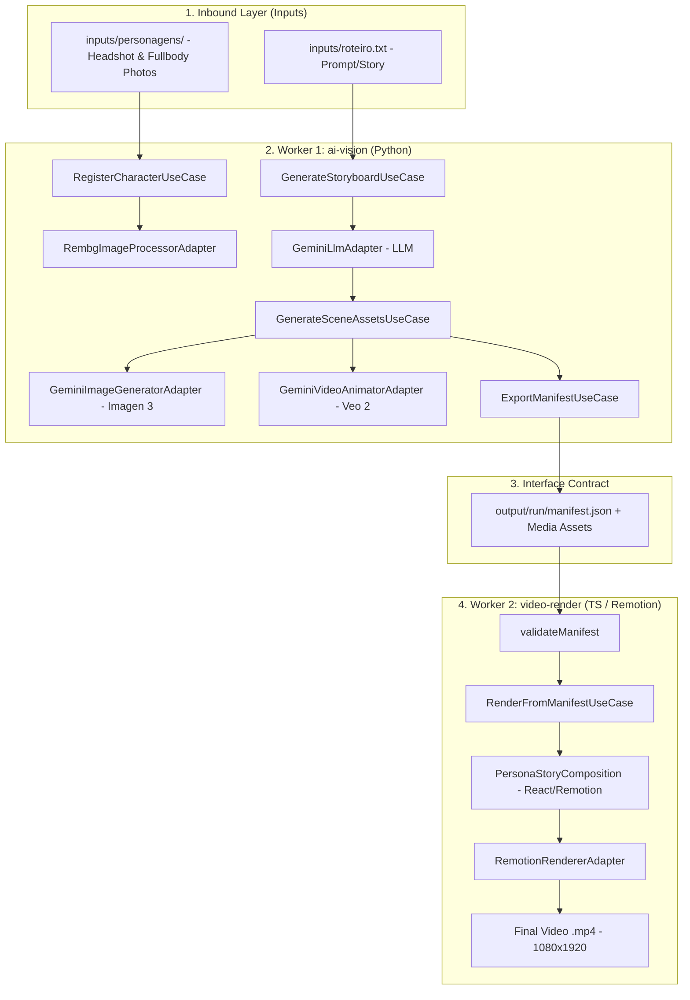

# 🎬 Motion Quest

> Platform for generating personalized animated videos (1m30s to 2min) from real photos and custom scripts, built with **Hybrid Hexagonal Architecture (Python + TypeScript / Remotion)** and specification-driven (**Harness SDD / SPEC-002 v3**).

---

## 🎯 Functional Objectives of the Project

**Motion Quest** automates the creation of vertical cinematic animated short films (formats such as Reels, TikTok, Shorts, and personalized promotional videos), turning real people into animated characters in custom narratives.

### 🌟 Key Features:

1. **Character Customization from Real Photos**:
   - Ingestion of cast photos (1 to 5 headshots and 1 to 5 full-body photos per character).
   - Automated background removal and facial crop detection via `rembg` and **OpenCV**.
   - Generation of reference collages and character sheets to ensure facial identity consistency across all scenes.

2. **Autonomous Scriptwriting & Storyboarding with LLM**:
   - Structured narrative generation using the **Google Gemini API** (`google-genai`).
   - Automatic breakdown into 12 to 30 scenes (duration from 3s to 7s per scene, default 5s, totaling 60s to 150s of video; standard recommendation of 18 to 24 scenes / 90s to 120s).
   - Transparent upfront cost estimation for image diffusion and video animation.

3. **AI-Driven Media Asset Generation & Animation**:
   - **Scene Image Generation**: High-definition concept art creation via **Google Imagen 3**, applying enriched visual prompts tailored to the cast.
   - **Image-to-Video Animation (I2V)**: Dynamic scene animation with asynchronous polling via **Google Veo 2**.
   - **Fault Tolerance & Resilience**: Exponential retry support on AI API calls and checkpoint/resume capability from failure points without losing progress.

4. **Cinematic Programmatic Rendering**:
   - Video composition in vertical cinematic resolution **1080x1920 (9:16)** at **30 FPS** using **Remotion** (React/Node.js).
   - Dynamic visual effects (Ken-Burns style camera zoom/pan motion).
   - Character identification badges on scene.
   - Stylized subtitles with slide-up animation and blurred background (`blur`).
   - Integrated soundtrack with master volume control.

---

## 🏛️ System Architecture

The project adopts a **Hybrid Hexagonal Architecture (Ports & Adapters)** distributed across two specialized workers, decoupled by a formal data contract (`manifest.json`).

### 📐 Worker Overview

```
┌──────────────────────────────────────────────────────────────────────────────────┐
│ Worker 1: AI, Vision & Scriptwriting (packages/ai-vision — Python 3.9+)         │
├──────────────────────────────────────────────────────────────────────────────────┤
│ • Pure Hexagonal Domain: Business rules, Entities, and Use Cases                 │
│ • Computer Vision: Background removal with rembg + OpenCV                        │
│ • AI Providers: Google Gemini (LLM), Google Imagen 3 (Images), Veo 2 (I2V)      │
│ • Output Contract: Export manifest.json + media assets to disk/storage           │
└────────────────────────────────────────┬─────────────────────────────────────────┘
                                         │ manifest.json + assets
                                         ▼
┌──────────────────────────────────────────────────────────────────────────────────┐
│ Worker 2: Video Compositor & Renderer (packages/video-render — Node/TS)          │
├──────────────────────────────────────────────────────────────────────────────────┤
│ • Contract Consumption: Strict schema validation of manifest.json                │
│ • React/Remotion Composition: Visual componentization into <Composition> & <Seq> │
│ • Cinematic Pipeline: Ken-Burns camera effects, cast badges, blur subtitles      │
│ • MP4 Export: Final rendered video generation (1080x1920 @ 30 FPS)               │
└──────────────────────────────────────────────────────────────────────────────────┘
```

### 🔁 Data Flow and Communication



### 📑 Interoperability Contract (`manifest.json`)
Communication between the Python Worker and the Node Worker occurs in a fully decoupled manner via `manifest.json` (schema v1.0). For full details on schema fields and types, refer to the [Manifest Data Contract](docs/architecture/CONTRACTS.md).

---

## 📂 Monorepo Structure

```
motion-quest/
├── Makefile                        # Unified build, test, and render automation
├── package.json                    # Root Node workspace dependencies & scripts
├── AGENTS.md                       # Instructions for autonomous AI agents
├── README.md                       # Main project documentation
│
├── docs/                           # Knowledge base and architecture docs
│   ├── INDEX.md                    # Main documentation index
│   ├── architecture/               # ARCHITECTURE.md, CONTRACTS.md, DECISIONS.md
│   ├── sdd/                        # SDD Specifications (SPEC-001, SPEC-002 v3)
│   └── guides/                     # Operational development guide
│
├── inputs/                         # User input data
│   ├── roteiro.txt                 # Base prompt or story script
│   └── personagens/                # Photos and cast character specifications
│       ├── cleber/                 # Photos (headshot, fullbody) and descricao.txt
│       └── pedro/
│
├── packages/
│   ├── ai-vision/                  # Worker 1 (Python 3.9+) — AI & Computer Vision
│   │   ├── src/
│   │   │   ├── domain/             # Domain entities (Character, Storyboard, Scene)
│   │   │   ├── application/        # Use cases and abstract ports
│   │   │   └── adapters/           # Concrete adapters (Gemini, Rembg, Storage, Mocks)
│   │   ├── tests/                  # Unit and integration test suite
│   │   ├── pyproject.toml          # Python project settings
│   │   └── .env.example            # Sample environment variables
│   │
│   └── video-render/               # Worker 2 (Node/TypeScript) — Remotion Compositor
│       ├── src/
│       │   ├── domain/             # Schema & manifest.json validation
│       │   ├── application/        # Video rendering use case
│       │   └── adapters/           # Remotion composition & CLI
│       ├── tests/                  # Parser and contract validator tests
│       └── package.json
│
└── output/                         # Generated manifests and temporary video outputs
```

---

## 🚀 How to Run

### 📋 Prerequisites
- **Python 3.9+** with `pip`
- **Node.js 18+** with `npm` / `npx`
- **FFmpeg** (installed on your system and accessible via PATH for Remotion rendering)
- **Gemini API Key** (`GEMINI_API_KEY`)

---

### 1️⃣ Environment Setup

1. **Clone the repository and install Node dependencies**:
   ```bash
   npm install
   cd packages/video-render && npm install && cd ../..
   ```

2. **Configure the Python environment**:
   ```bash
   cd packages/ai-vision
   python3 -m venv .venv
   source .venv/bin/activate
   pip install -r requirements.txt # or poetry/pip install depending on setup
   cd ../..
   ```

3. **Configure your Gemini API key**:
   Create or update `packages/ai-vision/.env`:
   ```env
   GEMINI_API_KEY=your_gemini_api_key_here
   ```

---

### 2️⃣ Running via Makefile (Recommended)

The monorepo provides a standard `Makefile` to trigger all workflows:

| Command | Description |
| :--- | :--- |
| `make test` | Executes the complete test suite across both workers |
| `make test-ai` | Runs unit tests for the AI & Vision Worker (Python) |
| `make test-video` | Runs unit tests for the Video Worker (Remotion/Node) |
| `make pipeline-mock` | Executes the AI pipeline in **offline/mock** mode (zero API credit consumption) |
| `make run` | Runs the AI pipeline with real photos from `inputs/` and renders the final video |
| `make render` | Renders the final MP4 video from the latest generated `manifest.json` |
| `make all` | Runs the full pipeline: **tests + mock pipeline + demo video render** |

---

### 3️⃣ Step-by-Step CLI Execution (Direct Mode)

If you prefer to run commands individually:

#### Step A: Generate `manifest.json` and assets via AI
```bash
cd packages/ai-vision
PYTHONPATH=. python3 src/adapters/inbound/cli/pipeline.py \
  --inputs ../../inputs \
  --prompt-file ../../inputs/roteiro.txt \
  --output ../../output/run
```

#### Step B: Render the MP4 video via Remotion
```bash
cd packages/video-render
node dist/adapters/inbound/cli/index.js \
  --manifest=../../output/run/manifest.json \
  --out=out/meu_video.mp4
```

The final video will be generated at: `packages/video-render/out/meu_video.mp4`.

---

## 🧪 Testing and Contract Validation

To verify system integrity before deployment or delivery:

```bash
make test
```

Quality gates validate:
1. **Python Domain Business Rules**: Cast photo count enforcement, scene duration calculations, and cost estimation logic.
2. **AI Pipeline Resilience**: Deterministic Gemini response mocking, retries, and error handling.
3. **JSON Contract Validation in Node/TS**: Ensuring the Remotion parser rejects malformed or incomplete manifests.

---

## 📋 SDD Governance & Specifications

This repository follows the **Specification-Driven Development (SDD)** methodology backed by the **TLC Harness Toolkit**:
- 📄 [SPEC-001: Hexagonal Architecture and Monorepo Structure](docs/sdd/SPEC_001_MOTION_QUEST_HEXAGONAL.md)
- 📄 [SPEC-002: Personalized Animated Video Generation (PoC v3)](docs/sdd/SPEC_002_PERSONA_VIDEO_GENERATION_POC.md)
- 📚 [Technical Documentation Index](docs/INDEX.md)
- 🏛️ [Architecture Deep-Dive](docs/architecture/ARCHITECTURE.md)
- 📄 [manifest.json Data Contract](docs/architecture/CONTRACTS.md)
- 🧭 [Architectural Decision Records (ADRs)](docs/architecture/DECISIONS.md)

---

## 📱 Architectural Roadmap (PoC ➔ Cloud ➔ Mobile)

The Hexagonal Architecture ensures the **domain core remains 100% reusable** across phases:

| Layer | Local PoC (Current Phase) | Cloud MVP (Next Phase) | Cross-Platform (Mobile App) |
| :--- | :--- | :--- | :--- |
| **Inbound** | Local Python / Node CLI | FastAPI REST API + Webhooks | SDK Client (REST / GraphQL) |
| **Orchestration** | Sequential terminal execution | Celery / Temporal + Redis | Async queues + Push Notifications |
| **Storage** | Local file system (`output/`) | Amazon S3 / Google Cloud Storage | CloudFront CDN / Signed URLs |
| **Renderer** | Remotion Local CLI | `@remotion/lambda` (AWS Lambda) | HLS Video Streaming |
| **Interface** | Input directory files | Next.js Web Application | React Native / Expo (iOS & Android) |

---

## 📄 License

This project is proprietary. All rights reserved.
