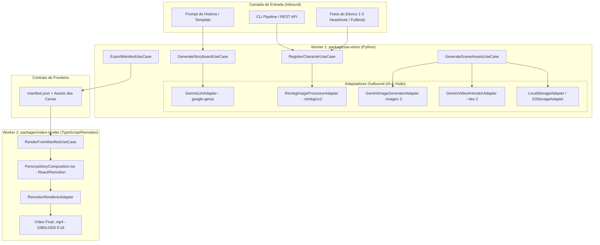

# 🏛️ Arquitetura do Sistema — Motion Quest

Este documento descreve a arquitetura do **Motion Quest**, detalhando o design dos microsserviços/workers, a aplicação da Arquitetura Hexagonal (Ports & Adapters), os contratos de comunicação e a estratégia de evolução contínua (PoC ➔ Cloud MVP ➔ Multiplataforma).

---

## 1. Visão Geral e Princípios

O **Motion Quest** é uma plataforma distribuída para geração automatizada de vídeos animados personalizados (1m30s a 2min) a partir de fotos de pessoas reais e prompts de história.

### Princípios Arquiteturais:
1. **Desacoplamento Especializado:** Cada worker utiliza a stack que melhor atende à sua especialidade (Python para IA e Visão Computacional; Node.js/TypeScript para composição e renderização React/Remotion).
2. **Zero Refatoração de Domínio (Hexagonal):** Entidades de negócio e Casos de Uso são puros e agnósticos a provedores de nuvem, filas ou bibliotecas de terceiros.
3. **Comunicação por Contrato Formal:** Os workers comunicam-se através de um schema JSON padronizado (`manifest.json`), permitindo execução local síncrona na PoC ou mensageria assíncrona (Redis/S3/EventBridge) em produção.
4. **Governança por Especificação (Harness SDD):** Nenhuma funcionalidade é implementada sem especificação aprovada e validação contínua através de gates de qualidade.

---

## 2. Diagrama de Alto Nível

---

## 3. Worker 1: IA, Visão & Roteirização (`packages/ai-vision`)

Construído em **Python 3.9+**, organizado em camadas estritamente hexagonais:

### 3.1. Camada de Domínio (`src/domain/`)
- **`entities/character.py`**: Representa um membro do elenco.
  - Regra: Exige entre 1 e 5 headshots e 1 e 5 fotos de corpo inteiro.
  - Armazena metadados e caminhos de assets pré-processados.
- **`entities/storyboard.py`**: Estrutura da narrativa em cenas de 3s a 7s (default 5s).
  - Regra Dura: 12 a 30 cenas; duração total entre 60s e 150s.
  - Regra Suave (Aviso): Recomendado 18 a 24 cenas (90s a 120s).
  - Inclui estimativa de custos de difusão de imagem e animação de vídeo.

### 3.2. Camada de Aplicação (`src/application/`)
- **Portas Inbound & Outbound**:
  - `LlmProviderPort`: Abstração de LLM para retorno estruturado (`StoryboardSchema`).
  - `ImageProcessorPort`: Abstração de recorte e remoção de fundo.
  - `ImageGeneratorPort`: Abstração de geração de imagem de cena.
  - `VideoAnimatorPort`: Abstração de animação Image-to-Video.
  - `StoragePort`: Abstração de persistência de arquivos.
- **Casos de Uso**:
  - `RegisterCharacterUseCase`: Valida, remove fundo e gera colagens de referência uma única vez (cache).
  - `GenerateStoryboardUseCase`: Invoca a LLM e valida limites do roteiro.
  - `GenerateSceneAssetsUseCase`: Gera imagem e clipe animado por cena com retry exponencial e suporte a retomada em caso de falha.
  - `ExportManifestUseCase`: Gera o arquivo `manifest.json`.

### 3.3. Camada de Adaptadores (`src/adapters/`)
- `GeminiLlmAdapter`: Utiliza o SDK `google-genai` com `response_schema` e a mesma chave de API configurada no projeto Mimo.
- `GeminiImageGeneratorAdapter`: Gera imagens de alta resolução via Google Imagen 3.
- `GeminiVideoAnimatorAdapter`: Gera clipes animados com polling assíncrono via Google Veo 2.
- `RembgImageProcessorAdapter`: Remoção de fundo rápida com `rembg` e crop de rosto com OpenCV.
- `LocalStorageAdapter`: Persiste arquivos no diretório `output/` na PoC.
- `Mock*Adapters`: Implementações determinísticas usando apenas biblioteca padrão Python para testes e validação offline.

---

## 4. Worker 2: Renderização de Vídeo (`packages/video-render`)

Construído em **TypeScript / Node.js** com **Remotion**:

### 4.1. Responsabilidades:
- Consumir o `manifest.json` e validar integridade do schema.
- Orquestrar a linha do tempo com `<Composition>` e `<Sequence>` do Remotion.
- Renderizar em resolução vertical cinematográfica **1080x1920 (9:16)** a 30fps.
- Aplicar transições suaves, efeito Ken-Burns de câmera lenta, badges dos personagens e legendas com estilo blur e slide-up.

---

## 5. Estratégia de Evolução (PoC ➔ Cloud MVP ➔ Multiplataforma)

| Componente | PoC Local | Cloud MVP | Multiplataforma (Mobile) |
| :--- | :--- | :--- | :--- |
| **Inbound** | CLI Python / Node | FastAPI + Webhooks | SDK REST / GraphQL |
| **Orquestração** | Sequencial local | Celery / Temporal + Redis | API assíncrona com Push Notifications |
| **Storage** | Disco local (`output/`) | AWS S3 / Cloud Storage | CloudFront CDN / URLs assinadas |
| **Renderizador** | Remotion CLI / Local | `@remotion/lambda` (AWS) | Cloud Player + HLS Streaming |
| **Frontend** | Terminal / Scripts | Next.js (Web App) | React Native / Expo (Android & iOS como no Mimo) |
