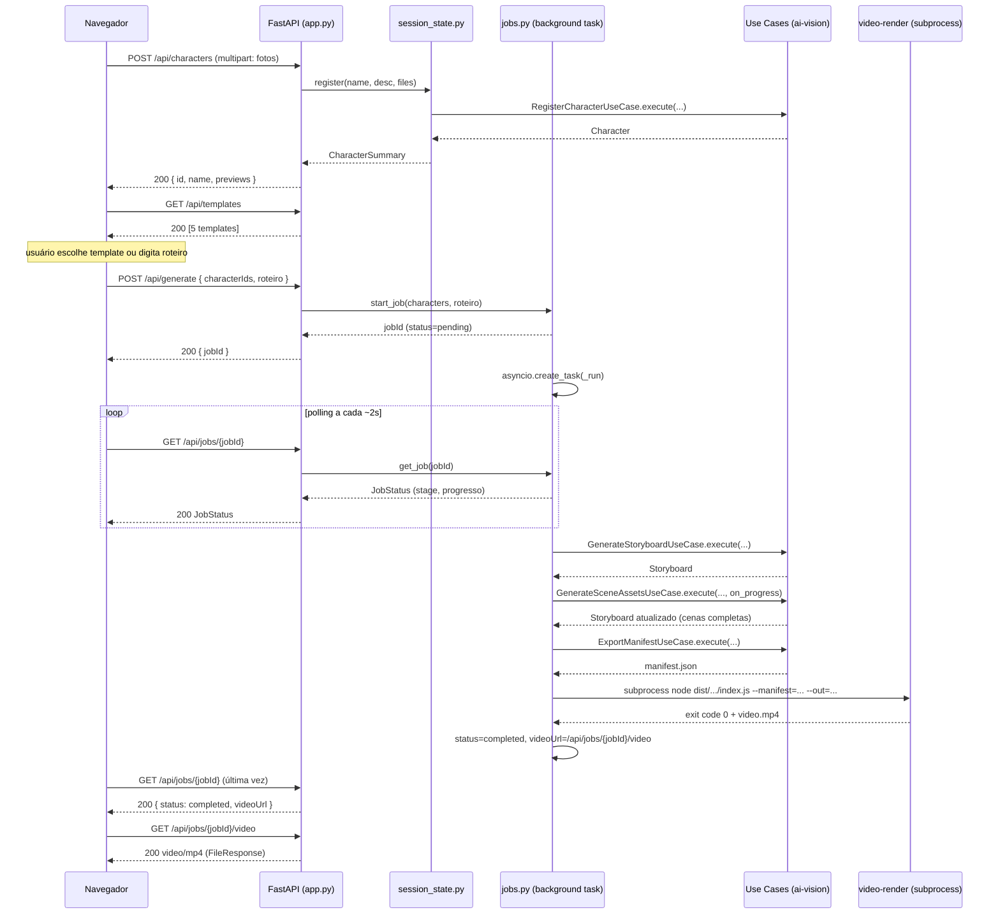
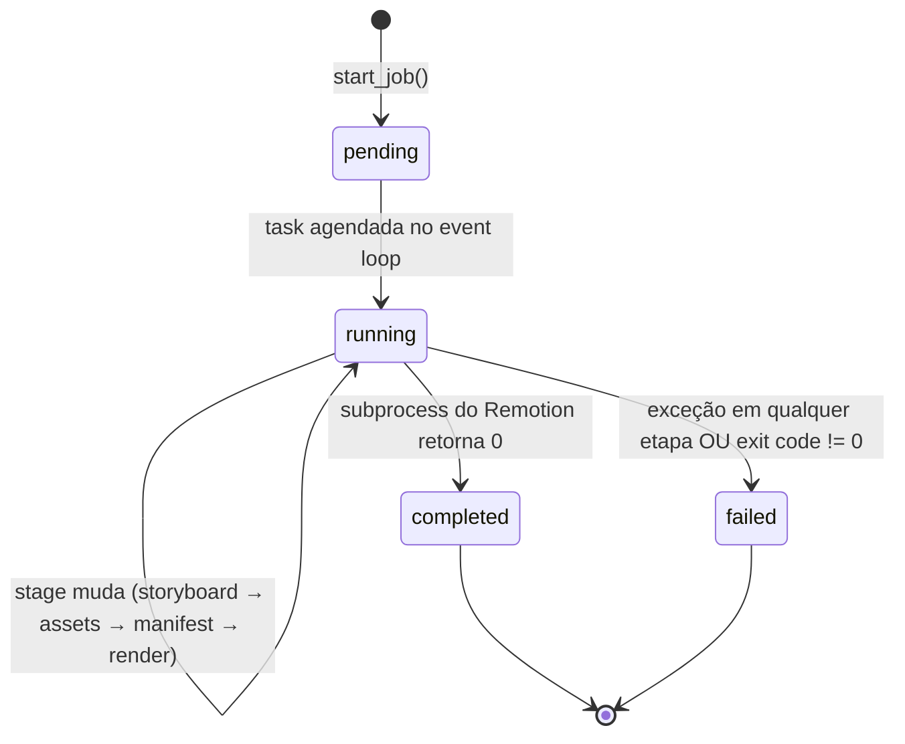

# SPEC-003: Interface Web Local para Criação de Personagens e Roteiros

## Metadata
- **Status:** DRAFT
- **Author:** Motion Quest Product & Engineering Team
- **Created:** 2026-09-22
- **Version:** 1.0.0
- **Depende de:** SPEC-002 (reaproveita os use cases e o contrato `manifest.json` sem alterações)

---

## 1. Visão Geral

Hoje o pipeline do Motion Quest só é operável via terminal (`make run`), exigindo que o usuário organize manualmente pastas em `inputs/personagens/` e edite `inputs/roteiro.txt`. Esta spec adiciona uma **interface web local, single-user, sem autenticação**, que roda em `http://127.0.0.1:8000` e permite, em 3 passos:

1. **Cadastrar o elenco** — nome, descrição e upload de fotos (headshot + corpo inteiro) por personagem.
2. **Definir o roteiro** — escrever um texto livre ou escolher um dos **5 templates prontos** (terror, ficção científica, drama, romance, comédia).
3. **Gerar o vídeo** — acompanhar o progresso cena a cena e, ao final, assistir/baixar o `.mp4` direto no navegador.

### Não-objetivos (fora de escopo desta spec)
- Autenticação, multi-usuário ou multi-sessão.
- Deploy em nuvem, HTTPS ou exposição fora de `127.0.0.1`.
- Edição de cenas individuais já geradas (retry de cena continua sendo trabalho de CLI/futuro).
- Fila de múltiplos jobs simultâneos — um job de geração por vez.

Esta spec é um **adiantamento local** da camada "MVP Cloud" já prevista na tabela de roadmap da SPEC-002 (`FastAPI + Next.js`), mas implementada como um **novo adaptador inbound** do Worker 1, sem framework de frontend, para manter a PoC simples. Nenhuma entidade, porta ou caso de uso de domínio é alterado — **zero refatoração de domínio**, conforme regra arquitetural do projeto.

---

## 2. Arquitetura

```
┌────────────────────────────────────────────────────────────────────┐
│  Worker 1: packages/ai-vision  (Python 3.12+)                      │
│                                                                      │
│  adapters/inbound/                                                  │
│   ├── cli/pipeline.py            (existente, inalterado)            │
│   └── web/                       (NOVO)                             │
│        ├── app.py                FastAPI app + rotas REST           │
│        ├── jobs.py                Orquestração em background +      │
│        │                          store de progresso em memória      │
│        ├── templates_catalog.py  5 templates de roteiro prontos     │
│        └── static/                index.html + app.js + styles.css  │
│                                    (HTML/JS puro, sem build step)    │
│                                                                      │
│  Reaproveita, sem alteração:                                        │
│   RegisterCharacterUseCase · GenerateStoryboardUseCase               │
│   GenerateSceneAssetsUseCase · ExportManifestUseCase                 │
└───────────────────────────────┬──────────────────────────────────────┘
                                 │ manifest.json
                                 │ subprocess (igual ao `make run`)
                                 ▼
┌────────────────────────────────────────────────────────────────────┐
│  Worker 2: packages/video-render — invocado via subprocess           │
│  node dist/adapters/inbound/cli/index.js --manifest=... --out=...   │
└────────────────────────────────────────────────────────────────────┘
```

- O `app.py` monta os arquivos estáticos em `/` e expõe a API em `/api/*` — um único processo, uma única porta.
- `jobs.py` roda a orquestração (`GenerateStoryboardUseCase` → `GenerateSceneAssetsUseCase` → `ExportManifestUseCase` → subprocess do Remotion) em uma `asyncio.Task` de background, atualizando um dicionário de progresso em memória que o frontend consulta via polling.
- Personagens cadastrados na sessão ficam em memória (lista simples, já que é single-user/local) + fotos processadas persistidas em `output/web/session/chars/<char_id>/`, reaproveitando o mesmo `RegisterCharacterUseCase` que a CLI usa.
- Detecção de modo (LIVE vs MOCK) reaproveita a mesma lógica do `pipeline.py`: `GEMINI_API_KEY` presente → LIVE, senão → MOCK. A UI exibe um indicador do modo ativo.

---

## 3. Requisitos Funcionais (EARS)

### RF-01: Cadastro de Personagens via Web
- **RF-01.1** Quando o usuário submete o formulário "Novo Personagem" com nome, ao menos 1 foto headshot e ao menos 1 foto de corpo inteiro, o sistema deve registrar o personagem via `RegisterCharacterUseCase` e exibi-lo na lista de elenco com uma miniatura de preview.
- **RF-01.2** Se o usuário submeter o formulário com 0 fotos headshot ou 0 fotos de corpo inteiro, o sistema deve rejeitar a submissão e exibir um erro de validação antes de chamar o backend.
- **RF-01.3** Quando o usuário remove um personagem da lista de elenco, o sistema deve removê-lo da sessão atual (não afeta jobs já em andamento).
- **RF-01.4** O sistema deve aceitar até 5 fotos headshot e 5 fotos de corpo inteiro por personagem (mesmo limite de `Character.validate()`), rejeitando o envio de uma 6ª foto do mesmo tipo com mensagem clara.

### RF-02: Roteiro Livre ou Template
- **RF-02.1** Quando a tela de roteiro carrega, o sistema deve exibir os 5 templates disponíveis (terror, ficção científica, drama, romance, comédia) com título e sinopse curta.
- **RF-02.2** Quando o usuário seleciona um template, o sistema deve pré-preencher a caixa de texto do roteiro com o `promptText` do template, permanecendo editável.
- **RF-02.3** Enquanto houver menos de 1 personagem cadastrado, o sistema deve manter o botão "Gerar Vídeo" desabilitado e exibir a mensagem "Cadastre ao menos um personagem primeiro".
- **RF-02.4** Se o usuário tentar gerar com o campo de roteiro vazio (ou com menos de 20 caracteres), o sistema deve bloquear a ação e indicar o motivo.

### RF-03: Geração com Progresso em Tempo Real
- **RF-03.1** Quando o usuário clica em "Gerar Vídeo", o sistema deve iniciar um job em background (storyboard → assets de cena → manifest → render) e retornar um `jobId` imediatamente, sem bloquear a requisição HTTP.
- **RF-03.2** Enquanto um job está em execução, o sistema deve expor a etapa atual e o progresso por cena (ex.: "Cena 4/20 — gerando imagem") via `GET /api/jobs/{jobId}`, e o frontend deve fazer polling a cada ~2s atualizando a UI.
- **RF-03.3** Se o job falhar em qualquer etapa, o sistema deve capturar o erro, marcar o job como `failed` com a etapa e mensagem do erro, e exibir isso ao usuário sem derrubar o processo do servidor.
- **RF-03.4** Se já existir um job com status `running`, uma nova requisição `POST /api/generate` deve ser rejeitada com HTTP 409 e mensagem indicando que é preciso aguardar o job atual terminar.

### RF-04: Entrega do Vídeo
- **RF-04.1** Quando um job é concluído com sucesso, o sistema deve exibir um player de vídeo embutido reproduzindo o `.mp4` final e um link de download.
- **RF-04.2** Enquanto nenhum job tiver sido concluído na sessão, a seção de player/download não deve ser exibida.

### RF-05: Transparência de Modo de Execução
- **RF-05.1** Quando `GEMINI_API_KEY` está presente no ambiente do servidor, o sistema deve operar em modo LIVE (Gemini/Imagen/Veo); caso contrário, em modo MOCK — e a UI deve exibir textualmente qual modo está ativo, replicando o mesmo comportamento já existente no `pipeline.py`.

### Restrições Não-Funcionais
- **NF-01** O servidor deve escutar apenas em `127.0.0.1` por padrão (sem autenticação, não deve ser exposto na rede).
- **NF-02** No máximo 1 job de geração ativo por vez por instância do servidor (ver RF-03.4).

---

## 4. Os 5 Templates de Roteiro

| ID | Gênero | Título | Sinopse |
| :--- | :--- | :--- | :--- |
| `terror` | Terror | A Última Noite na Cabana | Amigos isolados numa cabana percebem, tarde demais, que não estão sozinhos. |
| `ficcao_cientifica` | Ficção Científica | Sinal de Kepler-9 | Uma tripulação espacial parte em missão após captar um sinal misterioso. |
| `drama` | Drama | O Último Verão com Meu Pai | Um reencontro entre pai e filho depois de anos de distância. |
| `romance` | Romance | Cartas Que Nunca Enviei | Dois amigos de infância se reencontram anos depois por acaso. |
| `comedia` | Comédia | Confusão no Casamento | Uma série de mal-entendidos hilários ameaça o casamento dos sonhos. |

Conteúdo completo de `promptText` (usado como `user_prompt` de `GenerateStoryboardUseCase`, definido em `templates_catalog.py`):

```python
TEMPLATES = [
    {
        "id": "terror",
        "genre": "Terror",
        "title": "A Última Noite na Cabana",
        "synopsis": "Amigos isolados numa cabana percebem, tarde demais, que não estão sozinhos.",
        "promptText": (
            "Um grupo de amigos decide passar o fim de semana em uma cabana isolada no meio "
            "da floresta, longe de qualquer sinal de celular. Na primeira noite, ruídos "
            "estranhos começam a vir das árvores e uma sombra passa correndo pela janela. "
            "Aos poucos, cada um percebe que algo os observa há muito tempo, e a única saída "
            "é enfrentar o medo para sobreviver até o amanhecer."
        ),
    },
    {
        "id": "ficcao_cientifica",
        "genre": "Ficção Científica",
        "title": "Sinal de Kepler-9",
        "synopsis": "Uma tripulação espacial parte em missão após captar um sinal misterioso.",
        "promptText": (
            "Em um futuro próximo, uma pequena tripulação espacial capta um sinal de rádio "
            "vindo do sistema Kepler-9, a anos-luz da Terra. Decididos a investigar, eles "
            "embarcam em uma jornada arriscada através do espaço profundo, enfrentando falhas "
            "na nave, decisões difíceis e a descoberta de que o sinal esconde algo muito maior "
            "do que imaginavam sobre a origem da vida no universo."
        ),
    },
    {
        "id": "drama",
        "genre": "Drama",
        "title": "O Último Verão com Meu Pai",
        "synopsis": "Um reencontro entre pai e filho depois de anos de distância.",
        "promptText": (
            "Depois de anos sem se falar, um filho decide visitar o pai, que mora sozinho numa "
            "casa simples no interior. O verão que deveria ser breve se transforma em uma "
            "jornada de reconciliação, onde memórias antigas, mágoas guardadas e pequenos "
            "gestos de carinho os ajudam a reconstruir, aos poucos, o vínculo que o tempo "
            "havia desgastado."
        ),
    },
    {
        "id": "romance",
        "genre": "Romance",
        "title": "Cartas Que Nunca Enviei",
        "synopsis": "Dois amigos de infância se reencontram anos depois por acaso.",
        "promptText": (
            "Anos atrás, dois amigos de infância prometeram se reencontrar, mas a vida os "
            "levou para caminhos diferentes. Quando o destino os coloca frente a frente "
            "novamente em uma pequena cidade litorânea, sentimentos que pareciam esquecidos "
            "voltam à tona, e os dois precisam decidir se estão dispostos a arriscar tudo por "
            "uma segunda chance no amor."
        ),
    },
    {
        "id": "comedia",
        "genre": "Comédia",
        "title": "Confusão no Casamento",
        "synopsis": "Uma série de mal-entendidos hilários ameaça o casamento dos sonhos.",
        "promptText": (
            "No dia do casamento dos sonhos, tudo que pode dar errado, dá errado: o bolo "
            "derrete no calor, o padrinho perde as alianças e um convidado errado aparece "
            "vestido igual ao noivo. Em meio à confusão total, os noivos e a família precisam "
            "improvisar soluções cada vez mais absurdas para salvar a festa antes que os "
            "convidados percebam o caos nos bastidores."
        ),
    },
]
```

---

## 5. Contrato de API

Todas as rotas abaixo, exceto os estáticos, retornam/aceitam `application/json` (exceto `POST /api/characters`, que é `multipart/form-data`).

| Método | Rota | Descrição |
| :--- | :--- | :--- |
| `GET` | `/` | Serve `static/index.html` (SPA de página única). |
| `GET` | `/api/mode` | Retorna `{ "isLive": boolean }` — usado pela UI para exibir o modo ativo (RF-05.1). |
| `GET` | `/api/templates` | Lista os 5 templates de roteiro. |
| `GET` | `/api/characters` | Lista personagens cadastrados na sessão atual. |
| `POST` | `/api/characters` | `multipart/form-data`: `name`, `description`, `headshots[]`, `fullbody[]`. Registra via `RegisterCharacterUseCase`. |
| `DELETE` | `/api/characters/{id}` | Remove um personagem da sessão atual. |
| `POST` | `/api/generate` | Body `{ "characterIds": string[], "roteiro": string }`. Inicia o job em background. Retorna `{ "jobId": string }`. `409` se já houver job `running`. |
| `GET` | `/api/jobs/{jobId}` | Retorna o estado do job (ver schema abaixo). |
| `GET` | `/api/jobs/{jobId}/video` | Serve o `.mp4` final (`FileResponse`) quando `status == "completed"`. |

### Schema de resposta — `GET /api/jobs/{jobId}`

```json
{
  "jobId": "job_9f2c1a",
  "status": "running",
  "stage": "generating_assets",
  "sceneProgress": { "current": 4, "total": 20 },
  "message": "🎨 Gerando imagem: Cena 4/20",
  "manifestPath": null,
  "videoUrl": null,
  "error": null
}
```

`status`: `"pending" | "running" | "completed" | "failed"`.
`stage`: `"generating_storyboard" | "generating_assets" | "exporting_manifest" | "rendering_video" | "done"`.
(Refinado na Fase de Design — ver §8.4: não existe estágio `registering_cast` dentro do job porque o cadastro de personagens acontece *antes* de `POST /api/generate`, via `POST /api/characters`.)

---

## 6. Stack Adicional

| Responsabilidade | Tecnologia | Justificativa |
| :--- | :--- | :--- |
| Servidor Web | **FastAPI** + **uvicorn** | Já previsto no roadmap da SPEC-002 para o MVP Cloud; reaproveitado antecipadamente e localmente. |
| Upload multipart | **python-multipart** | Dependência exigida pelo FastAPI para `UploadFile`. |
| Frontend | HTML + CSS + JavaScript puro (sem framework, sem build step) | Consistente com "tela bem simples" e zero infraestrutura de build para uma PoC local. |

Novas dependências adicionadas a `packages/ai-vision/requirements.txt`: `fastapi`, `uvicorn[standard]`, `python-multipart`.

Novo alvo no `Makefile`:
```makefile
web:
	@echo "🌐 Subindo a interface web local em http://127.0.0.1:8000 ..."
	cd packages/ai-vision && PYTHONPATH=. uvicorn src.adapters.inbound.web.app:app --host 127.0.0.1 --port 8000
```

---

## 7. Gates de Qualidade (Harness SDD)

| Gate | Validação | Tipo |
| :--- | :--- | :--- |
| **Elenco mínimo** | Personagem requer ≥1 headshot + ≥1 fullbody antes de aceitar o cadastro | Hard |
| **Roteiro mínimo** | Texto do roteiro não vazio, ≥20 caracteres | Hard |
| **5 templates** | Exatamente 5 templates cobrindo terror, ficção científica, drama, romance e comédia, cada um com `id`, `genre`, `title`, `synopsis`, `promptText` não vazios | Hard |
| **Job único** | `POST /api/generate` retorna `409` se já houver job `running` | Hard |
| **Testes automatizados** | `pytest packages/ai-vision/tests/test_web_adapter.py` cobrindo rotas de templates, cadastro de personagem (válido/ inválido) e transições de status do job | Automated |
| **`make test`** | Bateria completa continua passando sem regressão | Automated |
| **Smoke E2E manual** | Fluxo completo em modo MOCK: cadastrar 1 personagem → escolher 1 template → gerar → assistir vídeo no navegador | Manual (documentado em `docs/sdd/WALKTHROUGH_SPEC_003.md` ao final da implementação) |

---

## 8. Design Detalhado (Fase 2 — Design)

### 8.1. Estrutura de Arquivos (novos)

```
packages/ai-vision/
├── requirements.txt                          # + fastapi, uvicorn[standard], python-multipart
├── src/
│   └── adapters/
│       └── inbound/
│           ├── cli/
│           │   ├── pipeline.py                # alterado: usa adapter_factory.py (sem mudança de comportamento)
│           │   └── adapter_factory.py          # NOVO — extraído de pipeline.py, compartilhado com web/
│           └── web/                            # NOVO
│               ├── __init__.py
│               ├── app.py                      # FastAPI app + rotas + montagem de estáticos
│               ├── schemas.py                  # Pydantic: CharacterSummary, TemplateOut, GenerateRequest, JobStatus
│               ├── session_state.py            # Store em memória do elenco da sessão
│               ├── jobs.py                     # JobStore em memória + orquestração assíncrona do job
│               ├── templates_catalog.py        # TEMPLATES (os 5 roteiros prontos)
│               └── static/
│                   ├── index.html
│                   ├── app.js
│                   └── styles.css
└── tests/
    └── test_web_adapter.py                     # NOVO
```

Nenhum arquivo em `src/domain/` ou `src/application/` é criado ou modificado — apenas `adapters/inbound/`.

### 8.2. Refino: `adapter_factory.py` compartilhado

Hoje `pipeline.py` decide entre adaptadores LIVE (`GeminiLlmAdapter`, `GeminiImageGeneratorAdapter`) e MOCK inline, dentro de `run_pipeline()`. Para o adaptador Web reaproveitar exatamente a mesma lógica (mesma detecção de `GEMINI_API_KEY`, mesmo fallback silencioso para mock em caso de erro de inicialização), essa lógica é extraída para uma função pura:

```python
# src/adapters/inbound/cli/adapter_factory.py
@dataclass
class AdapterBundle:
    llm_provider: LlmProviderPort
    image_processor: ImageProcessorPort
    image_gen: ImageGeneratorPort
    video_anim: VideoAnimatorPort
    is_live: bool

def build_adapters(force_mock: bool = False) -> AdapterBundle: ...
```

`pipeline.py` passa a chamar `build_adapters(force_mock=args.mock)` — refatoração pura do adaptador CLI, sem alteração de comportamento (coberta pelos testes existentes de `test-ai`). `web/jobs.py` chama a mesma função.

### 8.3. Diagrama de Sequência — Geração Completa



### 8.4. Máquina de Estados do Job



Apenas um job pode estar em `pending` ou `running` por vez (`NF-02` / `RF-03.4`) — controlado por uma variável `_active_job_id` em `jobs.py`, checada e setada dentro do mesmo `await` (sem race condition, pois FastAPI/uvicorn roda em um único processo e um único event loop nesta spec — ver §8.7).

### 8.5. Schemas (`schemas.py`)

```python
class CharacterSummary(BaseModel):
    id: str
    name: str
    description: str
    headshotPreviewUrl: str
    fullbodyPreviewUrl: str

class TemplateOut(BaseModel):
    id: str
    genre: str
    title: str
    synopsis: str
    promptText: str

class GenerateRequest(BaseModel):
    characterIds: list[str]
    roteiro: str = Field(min_length=20)

class SceneProgress(BaseModel):
    current: int
    total: int

class JobStatus(BaseModel):
    jobId: str
    status: Literal["pending", "running", "completed", "failed"]
    stage: Literal["generating_storyboard", "generating_assets", "exporting_manifest", "rendering_video", "done"]
    sceneProgress: SceneProgress | None = None
    message: str = ""
    manifestPath: str | None = None
    videoUrl: str | None = None
    error: str | None = None
```

### 8.6. Persistência de Personagens e Mídia

- Fotos enviadas são salvas em `output/web/session/uploads/<char_tmp_id>/` antes de chamar `RegisterCharacterUseCase` (que exige `Path` em disco, não bytes em memória).
- `RegisterCharacterUseCase` já persiste os assets processados em `output/web/session/chars/<char_id>/` — reaproveitado sem alteração.
- `app.py` monta um segundo diretório estático em `/media` → `output/web/session/`, para que `headshotPreviewUrl`/`fullbodyPreviewUrl` sejam URLs servíveis diretamente pelo `` do frontend.
- Cada job de geração usa seu próprio diretório `output/web/runs/<jobId>/` para `scenes/`, `clips/` e `manifest.json`, referenciando os caminhos absolutos das fotos já processadas dos personagens (o `manifest.json` grava paths absolutos, então não há necessidade de copiar arquivos entre diretórios).
- O vídeo final é escrito em `packages/video-render/out/<jobId>.mp4` (mesmo padrão do `make render` hoje) e servido via `GET /api/jobs/{jobId}/video`.

### 8.7. Modelo de Concorrência & Persistência (limitações assumidas conscientemente)

- Servidor roda como **um único processo `uvicorn`, sem `--workers`** — dicionários em memória (`_jobs`, `_characters`) são seguros porque todo acesso ocorre no mesmo event loop cooperativo, sem paralelismo real de threads/processos.
- **Sem persistência entre reinícios do servidor**: encerrar o `make web` perde o elenco cadastrado e o histórico de jobs. Isso é aceitável para uma PoC local single-user (documentado como limitação conhecida em §1 "Não-objetivos") — se necessário no futuro, vira uma spec própria de persistência (ex.: SQLite local).

### 8.8. Design do Frontend (`static/`)

Página única (`index.html`) com 3 seções sequenciais controladas por `app.js` (mostrar/ocultar via `hidden`, sem framework/roteador):

```
┌─────────────────────────────────────────────┐
│  Motion Quest — Interface Local  [Modo: MOCK]│
├─────────────────────────────────────────────┤
│ ① Elenco                                     │
│   [Nome] [Descrição]                         │
│   [Fotos headshot ⬆] [Fotos corpo inteiro ⬆] │
│   [+ Adicionar Personagem]                   │
│   ┌────────┐ ┌────────┐                      │
│   │ 🖼 Pedro │ │ 🖼 Ana  │  (cards com [x])    │
│   └────────┘ └────────┘                      │
├─────────────────────────────────────────────┤
│ ② Roteiro                                    │
│   [Terror] [Ficção] [Drama] [Romance] [Com.] │
│   ┌───────────────────────────────────────┐ │
│   │ (textarea editável, pré-preenchida)    │ │
│   └───────────────────────────────────────┘ │
├─────────────────────────────────────────────┤
│ ③ Gerar                                      │
│   [Gerar Vídeo]  (desabilitado até validar)  │
│   ▓▓▓▓▓▓▓░░░░░░  Cena 7/20 — animando…       │
│   ┌───────────────────────────────────────┐ │
│   │        <video> player (ao concluir)    │ │
│   └───────────────────────────────────────┘ │
│   [Baixar .mp4]                              │
└─────────────────────────────────────────────┘
```

`app.js` — responsabilidades (sem dependências externas, `fetch` nativo):
- `state`: `{ characters[], templates[], selectedTemplateId, currentJobId, pollHandle }`
- `loadTemplates()` / `loadCharacters()` — `GET` iniciais ao carregar a página.
- `submitCharacterForm(formEl)` — monta `FormData`, `POST /api/characters`, re-renderiza a lista; mostra erro inline em caso de `400`.
- `removeCharacter(id)` — `DELETE /api/characters/{id}`.
- `selectTemplate(id)` — preenche a textarea com `promptText` (usuário pode editar livremente depois).
- `updateGenerateButtonState()` — habilita "Gerar Vídeo" somente se `characters.length >= 1 && roteiro.length >= 20` (RF-02.3 / RF-02.4), rodando a cada `input`/mudança de estado.
- `startGeneration()` — `POST /api/generate`; em `409`, mostra "já existe uma geração em andamento"; em sucesso, guarda `jobId` e chama `pollJobStatus()`.
- `pollJobStatus()` — `setInterval(2000)` chamando `GET /api/jobs/{jobId}`; atualiza barra de progresso e mensagem; ao `status ∈ {completed, failed}`, `clearInterval` e renderiza o player (`<video src>`) ou a mensagem de erro.

### 8.9. Tratamento de Erros & Casos de Borda

| Caso | Comportamento |
| :--- | :--- |
| `ValueError` do `Character.validate()` (ex.: 0 fotos) | `POST /api/characters` retorna `400` com a mensagem original da entidade |
| 6ª foto do mesmo tipo enviada | Rejeitado no frontend (input `max` client-side) **e** no backend (mesma validação de `Character.validate()`, defesa em profundidade) |
| `POST /api/generate` com job `running` ativo | `409 { "error": "Já existe uma geração em andamento. Aguarde terminar." }` |
| Falha em qualquer Use Case durante o job | `job.status = "failed"`, `job.error` recebe `str(exc)`, `job.stage` mantém a etapa onde falhou |
| Subprocess do Remotion retorna código != 0 | `job.status = "failed"`, `job.error` recebe os últimos ~2000 caracteres do `stderr` do processo |
| `GET /api/jobs/{id}` com id inexistente | `404` |
| `GET /api/jobs/{id}/video` antes de `completed` | `404` |

---

## 9. Tasks (Fase 3)

Notas de execução descobertas ao planejar as tarefas (não mudam o design, só como ele é entregue):
- Não existe `requirements.txt`; dependências vivem em `packages/ai-vision/pyproject.toml`. Será criado um novo grupo de extras `web` (enxuto: só o que esta spec precisa), em vez de reaproveitar o grupo `prod` (que traz `celery`/`insightface`/`langgraph`, fora de escopo).
- `make test-ai` roda `unittest` via `tests/exec_tests.py`, carregando explicitamente só `TestAiVisionWorker` de `tests/run_tests.py`. `tests/test_domain_and_usecases.py` (estilo pytest) **não é executado hoje** por `make test`. Para o gate `test-before-stop` do harness (e `make test` do grind) realmente cobrirem os testes novos, os testes desta spec seguem o padrão `unittest.TestCase` já usado no projeto, e a T1 ensina o runner a descobrir automaticamente qualquer `test_*.py` novo.

| # | Task | Arquivos | Depende de | Comando de Verificação | Commit (Conventional) |
| :-- | :--- | :--- | :--- | :--- | :--- |
| T1 | Runner de testes passa a descobrir automaticamente qualquer `tests/test_*.py`, além da suíte explícita já existente | `tests/exec_tests.py` | — | `make test-ai` (as 4 suítes atuais continuam passando) | `test(ai-vision): auto-discover test_*.py files in the unittest runner` |
| T2 | Novo grupo de extras `web` no `pyproject.toml` (`fastapi`, `uvicorn[standard]`, `python-multipart`, `httpx`) e instalação no `.venv` | `pyproject.toml` | — | `pip install -e ".[dev,web]" && python3 -c "import fastapi, uvicorn, multipart, httpx"` | `chore(ai-vision): add fastapi/uvicorn/python-multipart/httpx web dependencies` |
| T3 | Extrair a seleção LIVE/MOCK de adaptadores do `pipeline.py` para `adapter_factory.py` compartilhado (refactor puro, sem mudança de comportamento) | `adapters/inbound/cli/adapter_factory.py`, `adapters/inbound/cli/pipeline.py` | T1 | `make test-ai` (regressão zero) | `refactor(ai-vision): extract LIVE/MOCK adapter selection into adapter_factory.py` |
| T4 | Catálogo dos 5 templates de roteiro prontos | `adapters/inbound/web/templates_catalog.py`, `tests/test_templates_catalog.py` | T1 | `make test-ai` (novos testes: exatamente 5, gêneros = {Terror, Ficção Científica, Drama, Romance, Comédia}, campos não vazios) | `feat(ai-vision): add 5 ready-made script templates` |
| T5 | Schemas Pydantic da API web | `adapters/inbound/web/schemas.py`, `tests/test_web_schemas.py` | T2 | `make test-ai` (valida `GenerateRequest` rejeita roteiro < 20 chars, `JobStatus` valida `Literal`s) | `feat(ai-vision): add pydantic schemas for the web API` |
| T6 | Store de personagens da sessão em memória (register/list/remove sobre `RegisterCharacterUseCase`) | `adapters/inbound/web/session_state.py`, `tests/test_session_state.py` | T3 | `make test-ai` (cadastro válido, rejeição de 0 fotos, remoção) | `feat(ai-vision): add in-memory session character store for the web UI` |
| T7 | Orquestração de job em background (`jobs.py`), com passo de render injetável para teste, máquina de estados e regra de job único (RF-03.4) | `adapters/inbound/web/jobs.py`, `tests/test_jobs.py` | T3, T5 | `make test-ai` (fluxo completo pending→completed com render fake; fluxo de falha; 2º job concorrente é rejeitado) | `feat(ai-vision): add background job orchestration for video generation` |
| T8 | App FastAPI: rotas de personagens/templates/jobs + montagem de `/static` e `/media` | `adapters/inbound/web/app.py`, `tests/test_web_adapter.py` | T4, T5, T6, T7 | `make test-ai` (TestClient cobrindo todas as rotas de §5, incluindo 400/404/409) | `feat(ai-vision): wire FastAPI app exposing character, template and job routes` |
| T9 | Frontend estático (3 seções: Elenco, Roteiro, Gerar) | `adapters/inbound/web/static/{index.html,app.js,styles.css}` | T8 | `make test-ai` (checagem leve: `GET /` 200 e contém os ids esperados) + smoke visual manual (T11) | `feat(web-ui): add static frontend for character registration, templates and generation` |
| T10 | Alvo `make web` | `Makefile` | T8 | `make -n web` (dry-run mostra o comando `uvicorn` correto) | `chore(build): add make web target to launch the local UI` |
| T11 | Smoke E2E manual em modo MOCK (subir `make web`, navegar pelo fluxo completo) + walkthrough documentado + `make test` completo (regressão dos 2 workers) | `docs/sdd/WALKTHROUGH_SPEC_003.md`, `docs/sdd/SPEC_003_WEB_UI_LOCAL.md` (Status → IMPLEMENTED) | T9, T10 | `make test` (zero regressão) + roteiro manual documentado | `docs(sdd): document SPEC-003 walkthrough and mark spec as implemented` |
